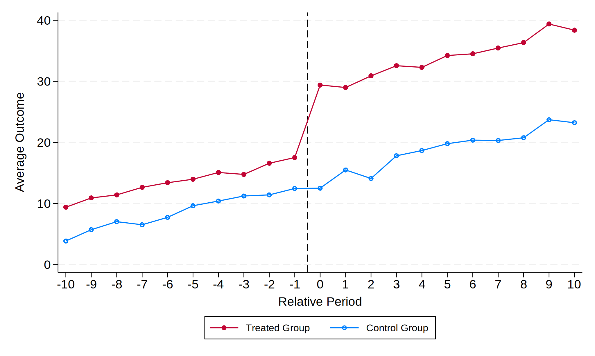
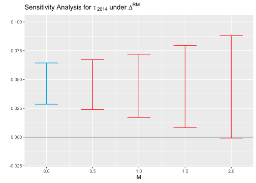

# Parallel Trends
The standard difference-in-difference method returns an unbiased estimate under three key assumptions:
  * parallel trends (PT) assumption, also known as common trend (CT) assumption;
  * no anticipation (NA) assumption;
  * homogeneous treatment effect assumption.

Sadly, these assumptions do not hold strictly in many empirical settings. Due to these sad phenomena, nowadays a lot of econometricians are working on relaxing these assumptions. In this repository, my shooting target is the **parallel trends** assumption.

<p align="center">
  <strong><em>It is hard to find parallel trends in this non-parallel world.</em></strong>
</p>

Please see my another repository ([DID Handbook](https://github.com/IanHo2019/DID_Handbook)) if you are interested in heterogeneity-robust DID estimators (which relax the homogeneity assumption).


## What Is Parallel Trends?
In a two-period DID setting where some units get treated in the second period, the parallel trends can be formalized as
$$E[Y_{i2}(0) – Y_{i1}(0) | D_i = 1] = E[Y_{i2}(0) – Y_{i1}(0) | D_i = 0]$$
where $Y_{it}(0)$ denotes unit $i$'s **untreated** potential outcome in period $t$.

In a staggered DID setting (i.e., different units get treated in different periods), the parallel trends can be formalized as
$$E[Y_{it}(\infty) – Y_{it'}(\infty) | G_i = g] = E[Y_{it}(\infty) – Y_{it'}(\infty) | G_i = g'] \quad \forall t \neq t', g \neq g'$$
where $Y_{it}(\infty)$ denotes unit $i$'s **never-treated** potential outcome in period $t$, and $G_i$ denotes unit $i$'s group (units are grouped based on when they get first treated; those units getting treated in the same period belong to the same group).


## Traditional Assessments of Parallel Trends
The parallel trends (PT) assumption is testable if we observe more than two periods.

### Graphic Evidence
The most popular way of assessing the PT assumption *was* visualizing the averages of observed outcomes. That is, researchers plot the average outcomes by group and across time periods, and then check whether the lines look approximately parallel. In math words, this method is equivalent to using human's naked eyes (or eyes with glasses) to test

$$\frac{1}{N_1} \sum_{i \in G_1} (Y_{it} – Y_{it'}) = \frac{1}{N_0} \sum_{i \in G_0} (Y_{it} – Y_{it'}) \quad \forall t, t' < t^* \text{ and } t \neq t'$$

where $N_1$ and $N_0$ are number of observations in treated and control groups ($G_1$ and $G_0$) respectively, $Y_{it}$ is an observed outcome, and $t^*$ indicates the treatment time. An example is shown below (Stata coding is [here](https://github.com/IanHo2019/Parallel_Trends/blob/main/Coding/PTA_graph.do)).

<div align="center">
  
</div>

### Event-Study Evidence
The visualization method is tiresome in staggered DID setting. In such cases, researchers had ever turned to a simple event-study specification (usually with a plot reporting results). The specification has the following form:
$$Y_{i,t} = \alpha_i + \phi_t + \sum_{s=0}^{S} D_{i,t-s} \beta_s + \sum_{s=1}^S D_{i,t+s} \gamma_s + e_{i,t}$$
where $D_{i,t}$ is a dummy equaling 1 if unit $i$ is (or has been) treated in period $t$ and equaling 0 otherwise. If the estimate of $\gamma_s$ (the pre-treatment parameter) is insignificant for all $s \in \\{1, 2, 3,…, S\\}$, researchers conclude that the parallel trends assumption is satisfied. A Stata coding example is [here](https://github.com/IanHo2019/Parallel_Trends/blob/main/Coding/PTA_event_study.do).

### Flaws of Traditional Methods
Unfortunately, neither method provides a good assessment of the PT assumption. The key reason is that they focus on the pre-treatment trends, but our interest is the trends over all time periods (including pre- and post-treatment periods). An interesting instance against the traditional PT test is given by [Roth et al. (2023)](https://doi.org/10.1016/j.jeconom.2023.03.008):

> [T]he average height of boys and girls evolves in parallel until about age 13 and then diverges, but we should not conclude from this that there is a causal effect of [bar mitzvahs](https://en.wikipedia.org/wiki/Bar_and_bat_mitzvah) (which occur for boys at age 13) on children's height!

Other reasons include:
 * The assessment based on the visualization of average outcomes depend on users' sense of sight. Plotting on empirical data often shows two lines that look imperfectly parallel. Then, how to assess?
 * The assessment based on an event-study regression in staggered setting is potentially biased because each coefficient estimate is contaminated by the cohort-specific ATT in other periods. See [Sun & Abraham (2021)](https://doi.org/10.1016/j.jeconom.2020.09.006) for details.

Therefore, we hunger for some more robust methods of assessing the PT assumption. More importantly, if the PT assumption really doesn't hold, we also hunger for some ways to do causal inference under its relaxed version.

## Relaxing PT: Bounding Post-Treatment Differences in Trends
[Rambachan & Roth (2023)](https://doi.org/10.1093/restud/rdad018) relax the PT assumption by imposing some restrictions on the post-treatment differences in trends. They further provide two inference procedures (conditional \& hybrid confidence intervals and fixed length confidence intervals) that are valid under their specified restrictions.

To understand their idea, we first must realize that the coefficient of interest $\beta$ in a DID specification can be decomposed as

$$\beta = \tau + \delta = \begin{pmatrix} \tau_{pre} \\\\ \tau_{post} \end{pmatrix} + \begin{pmatrix} \delta_{pre} \\\\ \delta_{post} \end{pmatrix}$$

where $\tau$ is the causal effect of interest and $\delta$ is the difference in trends between the treated and control groups in the absence of treatment. $\delta_{pre}$ is identified under the NA assumption ($\tau_{pre} = 0$), but $\tau_{post}$ cannot be identified if the PT assumption doesn't exactly hold ($\delta_{post} \neq 0$). From this decomposition we can also see how "ridiculous" the traditional PT test is --- the traditional test assesses whether $\delta_{post} = 0$ by testing $\delta_{pre} = 0$.

Rambachan and Roth then provide some choices of restriction sets $\Delta$ for parameter $\delta$:
 * If researchers believe that **the magnitude of the differential shocks to treated and control groups in the post-treatment period is not too different from the magnitude in the pre-treatment period**, then a reasonable restriction set is
$$\delta \in \Delta^{RM}(M) := \left\\{ \delta: \forall t \geq 0, |\delta_{t+1} - \delta_t| \leq M \cdot \max_{s < 0} |\delta_{s+1} - \delta_s| \right\\}$$
where $RM$ is the abbreviation for "**relative magnitude**", and $M \geq 0$ is a number specified by researchers. For example, $M = 1$ bounds the largest post-treatment difference in trends by the equivalent maximum in the pre-treatment period.
 * If researchers believe that **the slope of the difference in trends varies smoothly across consecutive periods**, then a reasonable restriction set is
$$\delta \in \Delta^{SD}(M) := \left\\{ \delta: \forall t, |(\delta_{t+1} - \delta_t) - (\delta_t - \delta_{t-1})| \leq M \right\\}$$
where $SD$ is the abbreviation for "**second derivative**" ($M \geq 0$ restricts the amount by which the slope of $\delta$ can change across consecutive periods, so equivalently it restricts the second derivative). As above, $M$ is a number specified by researchers; for example, if $M = 0$, then the difference in trends is restricted to be exactly linear.

Rambachan and Roth recommend that researchers should
 * Construct confidence intervals under reasonable restrictions on the violations of PT assumption, in which the set $\Delta$ should be motivated by domain knowledge in empirical settings.
 * Conduct sensitivity analyses to show how the estimated causal effect is sensitive to alternative restrictions.
 * Report the breakdown value of $M$ at which the estimated causal effect is no longer significant. 

The sensitivity analyses can be done by the `HonestDiD` package (written by [Ashesh Rambachan](https://asheshrambachan.github.io) at MIT) in R or `honestdid` package (written by Ashesh Rambachan, [Mauricio Caceres Bravo](https://mcaceresb.github.io) at Brown University, and [Jonathan Roth](https://www.jonathandroth.com) at Brown University) in Stata.

To install the latest version of `HonestDiD` in R, please run the following codes.
```r
install.packages("remotes")     # if you haven't installed this package
Sys.setenv("R_REMOTES_NO_ERRORS_FROM_WARNINGS" = "true")
remotes::install_github("asheshrambachan/HonestDiD")
```
See [here](https://github.com/asheshrambachan/HonestDiD) for an R coding example, and [here](https://github.com/IanHo2019/Parallel_Trends/blob/main/Coding/RR_Sensitivity_Analyses.R) is my update with more comments. Researchers can show the results of a sensitivity analysis easily by a plot as below.

<div align="center">
  
</div>

Looking at the figure above, we can easily find that the breakdown value for a significant effect is about 2.0. This figure provides strong evidence for the significance of the estimated causal effect $\tau_{2014}$, because it shows that the effect is significantly different from 0 even when the trends are inexactly parallel (i.e., when $M$ ranges from 0 to 1.5).

It is hopeful that [Rambachan & Roth (2023)](https://doi.org/10.1093/restud/rdad018)'s sensitivity analyses can be combined with [Callaway & Sant'Anna (2021)](https://doi.org/10.1016/j.jeconom.2020.12.001)'s heterogeneity-robust DID method. See [here](https://doi.org/10.1016/j.jeconom.2020.12.001) for an example showing how to combine them. However, note that this combination is still a work in progress and as of now no theoretical papers have discussed its plausibility. Plus, there might be some errors in that self-defined function (since I [found](https://github.com/IanHo2019/Parallel_Trends/blob/main/Coding/RR_CSDID_Cooperation.R) that it doesn't work well on Medicaid Expansion dataset when argument `e` is set to 1 or larger).

Finally, [here](https://github.com/mcaceresb/stata-honestdid) is a guideline for Stata users about the use of `honestdid` package. Note that to plot confidence intervals by the `honestdid` command, the `coefplot` package must be installed. I tried to combine several heterogeneity-robust DID methods (implemented by `csdid`, `eventstudyinteract`, and `did_multiplegt` in Stata) with the sensitive analyses (see [here](https://github.com/IanHo2019/Parallel_Trends/blob/main/Coding/RR_Sensitivity_Analyses_with_Staggered_DID.do) for my coding). The key point is that we need to provide two matrices (storing coefficient and variance estimates, respectively), `b` and `V` by default, for the `honestdid` command.

## To Be Continued...
I sincerely thank my pre-PhD cohort [JaeSeok Oh](https://github.com/JaeSeok1218) for his assistance in writing this repository. Comments and corrections on my coding are always welcomed; you can report them by posting in `Issues` or by contacting me privately by [email](mailto:ianho0815@outlook.com?subject=[GitHub]%20Parallel%20Trends).
